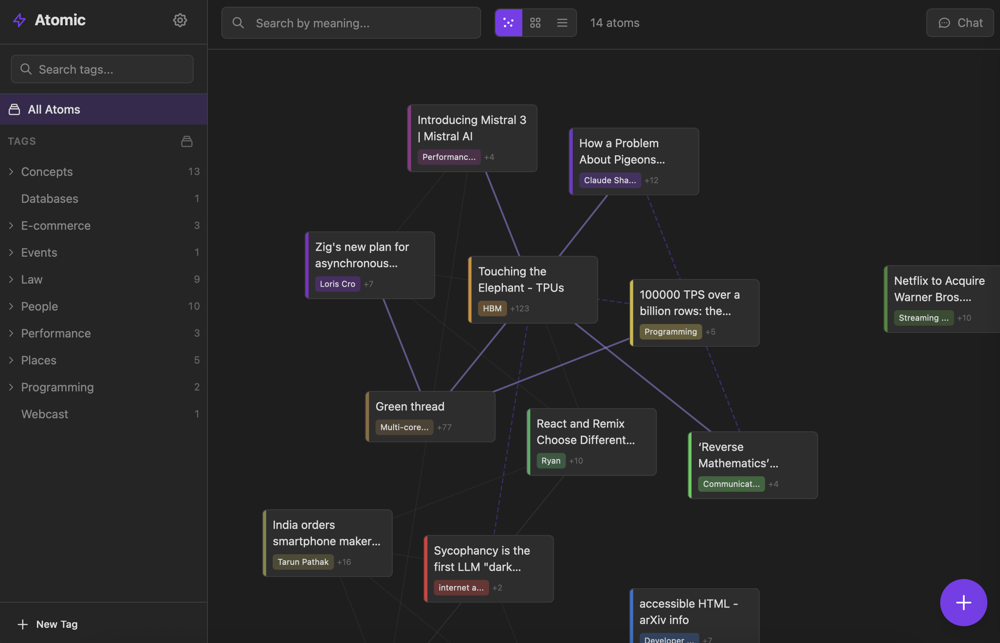
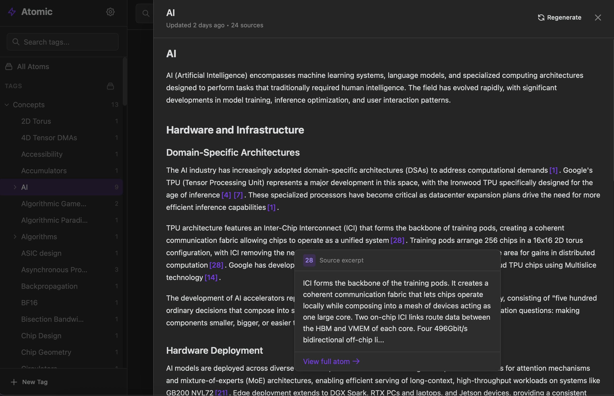
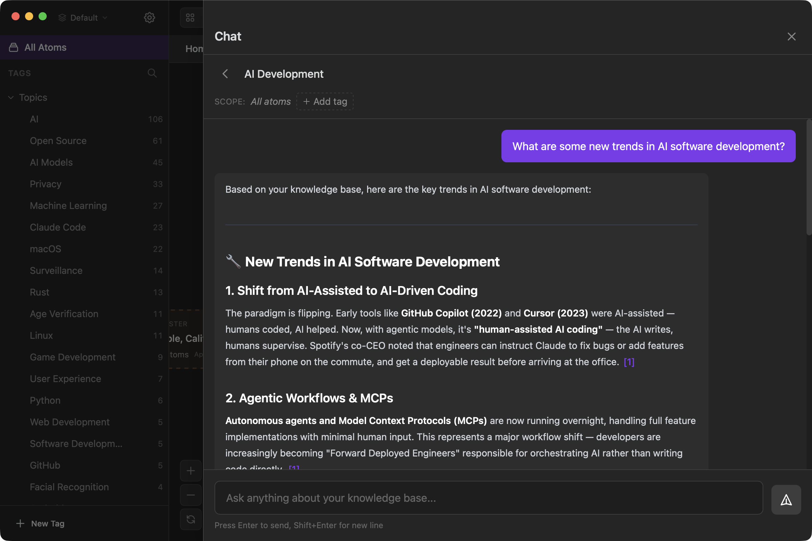

# Atomic

A personal knowledge base that turns markdown notes into a semantically-connected, AI-augmented knowledge graph.

Atomic stores knowledge as **atoms** — markdown notes that are automatically chunked, embedded, tagged, and linked by semantic similarity. Your atoms can be synthesized into wiki articles, explored on a spatial canvas, and queried through an agentic chat interface.







## Features

- **Atoms** — Markdown notes with hierarchical tagging, source URLs, and automatic chunking
- **Semantic Search** — Vector search over your knowledge base using sqlite-vec
- **Canvas** — Force-directed spatial visualization where semantic similarity determines layout
- **Wiki Synthesis** — LLM-generated articles with inline citations, built from your notes
- **Chat** — Agentic RAG interface that searches your knowledge base during conversation
- **Auto-Tagging** — LLM-powered tag extraction organized into hierarchical categories
- **Multiple AI Providers** — OpenRouter (cloud) or Ollama (local) for embeddings and LLMs
- **Browser Extension** — Capture web content directly into Atomic
- **MCP Server** — Expose your knowledge base to Claude and other AI tools
- **Multi-Database** — Multiple knowledge bases with a shared registry
- **iOS App** — Native SwiftUI client for reading and writing atoms on mobile

## Getting Started

Atomic runs as a **desktop app** (Tauri), a **headless server** (Docker/Fly.io), or both.

### Desktop App

Download the latest release for your platform from [GitHub Releases](https://github.com/kenforthewin/atomic/releases) (macOS, Linux, Windows).

On first launch, the setup wizard walks you through AI provider configuration.

### Self-Host with Docker Compose

```bash
git clone https://github.com/kenforthewin/atomic.git
cd atomic
docker compose up -d
```

This starts the API server and web frontend. Open `http://localhost` and claim your instance through the setup wizard.

### Deploy to Fly.io

```bash
cp fly.toml.example fly.toml
fly launch --copy-config --no-deploy
fly volumes create atomic_data --region <your-region> --size 1
fly deploy
```

Open `https://your-app.fly.dev` and claim your instance. The public URL for OAuth/MCP is auto-detected from the Fly app name.

### Standalone Server

```bash
cargo run -p atomic-server -- --data-dir ./data serve --port 8080
```

On first run, create an API token:

```bash
cargo run -p atomic-server -- --data-dir ./data token create --name default
```

## AI Provider Setup

Atomic needs an AI provider for embeddings, tagging, wiki generation, and chat.

- **OpenRouter** (cloud) — Get an API key from [openrouter.ai](https://openrouter.ai). Supports separate model selection for embedding, tagging, wiki, and chat.
- **Ollama** (local) — Install [Ollama](https://ollama.com) and pull models (e.g., `ollama pull nomic-embed-text`). Atomic auto-discovers available models.

Configure via the setup wizard on first launch, or later in Settings.

## Browser Extension

The Atomic Web Clipper captures web content as atoms:

1. Open Chrome/Edge/Brave and navigate to `chrome://extensions`
2. Enable "Developer mode"
3. Click "Load unpacked" and select the `extension/` directory
4. Configure your server URL and API token in the extension options

Captures are queued offline and synced when the server is available.

## MCP Server

Atomic exposes an MCP endpoint for Claude and other AI tools to search and create atoms.

The endpoint runs at `/mcp` on your server (e.g., `http://localhost:8080/mcp`).

**Claude Desktop config** (`~/Library/Application Support/Claude/claude_desktop_config.json`):

```json
{
  "mcpServers": {
    "atomic": {
      "url": "http://localhost:44380/mcp"
    }
  }
}
```

**Available tools:** `semantic_search`, `read_atom`, `create_atom`

## Architecture

All business logic lives in `atomic-core`, a standalone Rust crate with no framework dependencies. Every client is a thin wrapper adapting it to a transport:

```
                    +------------------+
                    |   atomic-core    |
                    |   (all logic)    |
                    +--------+---------+
              +--------------+--------------+
              v              v              v
    +-----------+    +--------------+    +----------+
    | src-tauri |    |atomic-server |    |atomic-mcp|
    | (desktop) |    | (REST + WS)  |    |  (stdio) |
    +-----+-----+    +------+-------+    +----------+
          |                 |
    +-----v-----+    +------v-------+
    |  React UI  |    | HTTP clients |
    |            |    | (iOS, web)   |
    +------------+    +--------------+
```

## Project Structure

```
Cargo.toml                  # Workspace root
crates/atomic-core/         # All business logic
crates/atomic-server/       # REST + WebSocket + MCP server
crates/atomic-mcp/          # Standalone MCP server (stdio)
crates/mcp-bridge/          # HTTP-to-stdio MCP bridge
src-tauri/                  # Tauri desktop app
src/                        # React frontend (TypeScript)
ios/                        # Native iOS app (SwiftUI)
extension/                  # Chromium browser extension
scripts/                    # Import and utility scripts
```

## Development

### Prerequisites

- Node.js 22+
- Rust toolchain ([rustup](https://rustup.rs))
- For the desktop app: platform-specific [Tauri v2 dependencies](https://v2.tauri.app/start/prerequisites/)

### Commands

```bash
npm install                       # Install frontend dependencies

# Desktop app
npm run tauri dev                 # Dev with hot reload
npm run tauri build               # Production build

# Server only
cargo run -p atomic-server -- serve --port 8080

# Frontend only
npm run dev                       # Vite dev server

# Checks
cargo check                       # All workspace crates
cargo test                        # All tests
npx tsc --noEmit                  # Frontend type check
```

## Tech Stack

| Layer | Technology |
|-------|------------|
| Core | Rust, SQLite + sqlite-vec, tokio |
| Desktop | Tauri v2 |
| Server | actix-web |
| Frontend | React 18, TypeScript, Vite 6, Tailwind CSS v4, Zustand 5 |
| Editor | CodeMirror 6 |
| Canvas | d3-force, react-zoom-pan-pinch |
| iOS | SwiftUI, XcodeGen |
| AI | OpenRouter or Ollama (pluggable) |

## License

MIT
